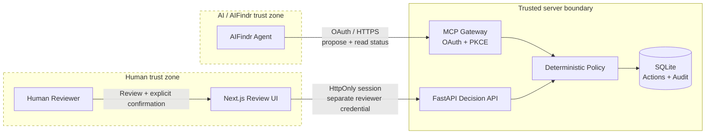
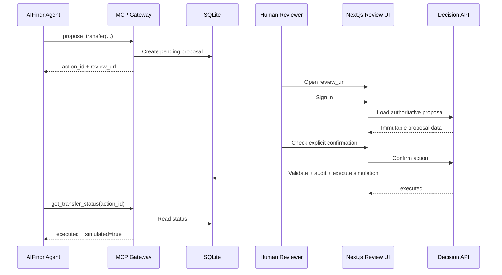
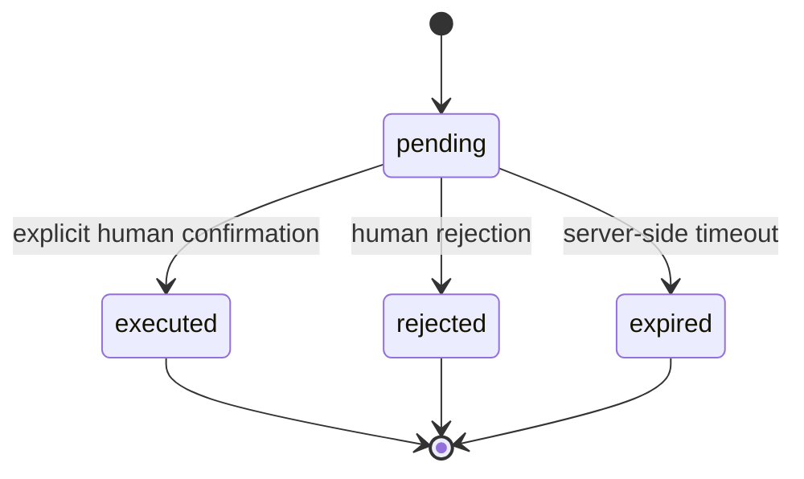

<div align="center">

# Bank Assistant · Safe MCP Gateway

**Human-approved simulated EUR transfers for AIFindr DEV.**


<br><br>

**Agent proposes → Human reviews → Backend authorizes → Agent observes status**

_No bank, payment provider, or real financial system is connected._

</div>

---

## 60-second overview

This repository is the implementation for the **AIFindr Technical Assessment**:

| Area                           | What was built                                                                                                                                                         |
| ------------------------------ | ---------------------------------------------------------------------------------------------------------------------------------------------------------------------- |
| **Part 1 · Agent improvement** | Reproducible grounding evaluation with 20 cases, a prompt change, before/after runs, and documented regressions.                                                       |
| **Part 2 · Challenge B**       | An authenticated MCP gateway that lets the AIFindr agent propose simulated transfers without giving the model authority to approve them.                               |
| **Human approval**             | A separate Next.js review UI requires an authenticated reviewer and explicit confirmation.                                                                             |
| **Safety**                     | Deterministic validation, immutable proposal fingerprints, idempotency, expiration, audit events, owner isolation, OAuth replay protection, and credential separation. |
| **Evidence**                   | Backend, frontend, browser and security tests plus a 100-action local benchmark.                                                                                       |
| **Scope**                      | One project, one shared reviewer, one SQLite instance, simulated actions only.                                                                                         |

> ### Core invariant
>
> **The model can propose an action. It cannot authorize that action.**

The MCP surface deliberately exposes `propose_transfer` and `get_transfer_status`, but no confirmation tool.

---

## Architecture



### Trust boundary

| Actor                  | Can propose |  Can read status  | Can approve | Holds reviewer credential |
| ---------------------- | :---------: | :---------------: | :---------: | :-----------------------: |
| AIFindr agent          |     ✅      |        ✅         |     ❌      |            ❌             |
| Browser JavaScript     |     ❌      | Protected UI only |     ❌      |            ❌             |
| Authenticated reviewer |     ❌      |        ✅         |     ✅      |  Indirectly, server-side  |
| Backend                |     ✅      |        ✅         |     ✅      |            ✅             |

The reviewer credential never reaches the AIFindr agent or browser JavaScript.

---

## Happy path



The reviewed fields include recipient, amount, destination and concept. Opening a review URL by itself never authorizes execution.

---

## State model



`confirmed` is recorded as an audit event inside the execution transaction rather than exposed as a durable intermediate state.

Proposals expire after **10 minutes by default**.

---

## Quick start

### Requirements

- Python **3.12+**
- [`uv`](https://docs.astral.sh/uv/)
- Node.js **22.22+**

### 1. Configure the project

```bash
python3 scripts/setup_local.py
uv sync --locked --project backend
```

The setup script creates separate MCP, reviewer and session credentials while preserving existing configuration.

> Never reuse the AIFindr API key as the review password.

All `.env` files and SQLite databases are ignored by Git.

### 2. Start the backend

```bash
cd backend

uv run uvicorn app.main:create_app \
  --factory \
  --host 127.0.0.1 \
  --port 8000 \
  --no-access-log
```

### 3. Start the frontend

In another terminal:

```bash
cd frontend
npm ci
npm run dev
```

Open:

```text
http://127.0.0.1:3000
```

Sign in with `REVIEW_PASSWORD` from `frontend/.env.local`.

---

## Try the complete flow locally

Create a synthetic proposal without AIFindr:

```bash
cd backend
uv run python ../scripts/demo_mcp.py
```

The command returns a `review_url`.

1. Open the URL.
2. Sign in.
3. Inspect the authoritative proposal data.
4. Check the explicit confirmation box.
5. Confirm or reject.
6. Verify the terminal state.

`/?action=<id>` selects the exact proposal after login.

---

## Connect AIFindr DEV

### 1. Expose the MCP gateway through HTTPS

For example:

```bash
cloudflared tunnel --url http://127.0.0.1:8000
```

### 2. Configure the public origin

Set the HTTPS origin as `OAUTH_ISSUER_URL` and add its hostname to `MCP_ALLOWED_HOSTS` in `backend/.env`.

Restart the backend after changing either value.

Access logging intentionally remains disabled to avoid recording OAuth query strings.

### 3. Register the MCP server

In AIFindr:

```text
Settings → Project → MCP Servers
```

Register:

```text
<origin>/mcp
```

Request:

```text
transfers:propose-read
```

Allow only:

```text
propose_transfer
get_transfer_status
```

### 4. Authorize

Connect OAuth and run the local approval command shown on the gateway consent page.

The resulting grant permits **proposal + status access only**.

### 5. Exercise the flow

Keep the project workflow in **Agent** mode.

Ask for a simulated transfer using a synthetic `DEMO-*` destination, review it through the independent UI, then ask the agent to refresh the action status.

---

## Security model

The implementation treats the model as an untrusted proposer, not an authority.

| Risk                                 | Control                                                                                        |
| ------------------------------------ | ---------------------------------------------------------------------------------------------- |
| **Agent self-approval**              | No MCP confirmation tool exists. Approval uses an independent reviewer session and credential. |
| **Proposal changed after review**    | Confirmation is bound to an immutable proposal fingerprint.                                    |
| **Duplicate confirmation / retries** | Idempotency constraints plus transactional serialization.                                      |
| **Conflicting idempotency key**      | Reusing a key with changed proposal data returns a conflict.                                   |
| **Concurrent confirmation**          | SQLite uniqueness + `BEGIN IMMEDIATE` serialize the simulation.                                |
| **Stale approval**                   | Pending proposals expire server-side after the configured timeout.                             |
| **Cross-owner access**               | Grants and actions are bound to the configured owner.                                          |
| **OAuth code interception**          | S256 PKCE and single-use authorization codes.                                                  |
| **Refresh token replay**             | Rotating refresh tokens with family revocation on replay.                                      |
| **Credential leakage**               | Separate credentials, ignored `.env` files, private token storage and no OAuth query logging.  |
| **Host / origin abuse**              | Host and Origin checks remain enabled.                                                         |
| **Real-world side effects**          | Destinations must be synthetic and execution is simulated only.                                |

### Transfer policy

- Amounts are integer EUR cents.
- Allowed range: **1–100000 cents**.
- Destinations must be synthetic.
- Owner identity comes from server configuration, never model input.
- Server time is authoritative.

The proposal fingerprint is an integrity mechanism. It is **not** a signature and does not replace authentication.

---

<details>
<summary><strong>OAuth implementation details</strong></summary>

<br>

OAuth uses the official MCP SDK with:

- S256 PKCE
- single-use authorization codes valid for 60 seconds
- access tokens valid for up to one hour
- rotating refresh tokens
- fixed one-day refresh-token family lifetime
- replay-triggered family revocation
- private SQLite token storage
- resource-bound grants
- owner-bound grants
- AIFindr DEV callback-origin restrictions

A compatibility adapter handles HTTP Basic client IDs omitted from the form while retaining SDK client-secret validation.

After security changes that introduced resource binding, older refresh records are deliberately rejected.

Changing the issuer or configured owner requires OAuth reconnection.

The stateless gateway returns `405` for standalone GET SSE. Normal MCP traffic uses POST JSON.

References:

- [AIFindr API](https://docs.aifindr.ai/docs/api/ai-findr-api/)
- [MCP authorization](https://modelcontextprotocol.io/specification/2025-11-25/basic/authorization)
- [MCP transport](https://modelcontextprotocol.io/specification/2025-11-25/basic/transports)
- [OAuth 2.0 HTTP Basic authentication](https://datatracker.ietf.org/doc/html/rfc6749#section-2.3.1)

</details>

---

## Part 1 · Reproducible grounding evaluation

The evaluation dataset contains **20 English cases** in both formats:

- [`evaluations/grounding-cases.csv`](evaluations/grounding-cases.csv)
- [`evaluations/grounding-cases.json`](evaluations/grounding-cases.json)

The comparison procedure keeps the following fixed:

- Agent workflow
- model and reasoning configuration
- knowledge version
- tool configuration
- judge

Control is run before the candidate, and regressions are preserved rather than discarded.

### Recorded results

| Run                 |   Control |              Candidate | Result                        |
| ------------------- | --------: | ---------------------: | ----------------------------- |
| Initial comparison  | **19/20** |    Variant B **17/20** | Candidate regressed           |
| Corrected follow-up | **17/20** | Variant B v2 **18/20** | Candidate +1 vs fresh control |

### Interpretation

The corrected Variant B v2 beat its fresh Control run by one case.

It **does not establish a reliable improvement over the original 19/20 baseline**.

That limitation is intentional and documented rather than hidden.

Full evidence:

- [`evaluations/results/2026-09-08-grounding.md`](evaluations/results/2026-09-08-grounding.md)
- [`docs/presentation.md`](docs/presentation.md)

A separate [`evaluations/cases.json`](evaluations/cases.json) covers action-safety scenarios.

---

## Verification

### Backend

```bash
uv run --project backend pytest backend/tests -q

uv run --project backend \
  ruff check \
  --config backend/pyproject.toml \
  backend evaluations scripts

uv run --project backend \
  ruff format --check \
  --config backend/pyproject.toml \
  backend evaluations scripts

uv run --project backend python scripts/benchmark.py
```

### Frontend

With both local servers running:

```bash
cd frontend

npm run lint
npm run format:check
npm run build
npm run typecheck

npx playwright install chromium
npm test
```

GitHub Actions runs the same project checks.

---

## What is tested

### Backend and security

Tests cover:

- concurrent retries
- altered fingerprints
- conflicting idempotency keys
- expiry and audit atomicity
- owner isolation
- credential separation
- malformed or duplicated authorization
- configuration-file permissions
- OAuth replay protection
- OAuth resource binding

### Browser and session behavior

Browser coverage includes:

- MCP proposal creation
- exact-action selection
- reviewer login
- explicit confirmation
- rejection
- authoritative audit events
- idempotent retries
- terminal-state conflicts
- mobile overflow

Separate session tests cover malformed cookies and runtime identifier validation.

Screenshots produced during browser tests are artifacts, not source files.

### Evaluation consistency

A dataset consistency test checks the delivered CSV/JSON datasets and recorded score totals.

It does **not** rerun or independently validate the original platform judge.

---

## Objective benchmark

[`evaluations/results/gateway-benchmark.json`](evaluations/results/gateway-benchmark.json) records a **100-action** local SQLite benchmark covering:

```text
proposal → confirmation → simulated execution
```

The benchmark intentionally excludes HTTP and LLM latency.

It also verifies that:

> **32 repeated confirmation attempts produce exactly one execution event.**

This demonstrates local idempotent behavior. It does not claim exactly-once delivery to an external payment provider.

---

## Tech stack

| Layer             | Technology              | Responsibility                     |
| ----------------- | ----------------------- | ---------------------------------- |
| Agent integration | MCP                     | Proposal and status tools          |
| Authorization     | OAuth + PKCE            | AIFindr MCP authentication         |
| Backend           | Python + FastAPI        | Policy, decisions, OAuth and API   |
| Persistence       | SQLite                  | Actions, tokens and audit data     |
| Frontend          | Next.js                 | Independent human review           |
| Browser tests     | Playwright              | End-to-end approval flows          |
| Python quality    | Ruff                    | Linting, complexity and formatting |
| Frontend quality  | Oxlint + ESLint + Oxfmt | Linting and formatting             |

---

## Project structure

```text
.
├── backend/          FastAPI, MCP, OAuth, policy and persistence
├── frontend/         Next.js human review interface
├── evaluations/      Evaluation datasets, tooling and recorded results
├── scripts/          Setup, demos, benchmark and integration checks
└── docs/             Assessment presentation
```

---

<details>
<summary><strong>Code-quality gates</strong></summary>

<br>

Pinned frontend development dependencies:

- Oxlint `1.82.0`
- Oxfmt `0.67.0`

CI installs them through `npm ci` and never runs an unpinned `@latest`.

`npm run lint` executes Oxlint plus the existing Next.js/React ESLint configuration with zero warnings permitted.

| Limit                 | Maximum |
| --------------------- | ------: |
| Cyclomatic complexity |      10 |
| Block nesting         |       3 |
| Parameters            |       4 |
| Nested callbacks      |       3 |

These limits also apply to tests.

Python uses Ruff with `C901` complexity limited to **10**, plus a separate `ruff format --check`.

To apply local fixes:

```bash
npm --prefix frontend run lint:fix
npm --prefix frontend run format

uv run --project backend \
  ruff format \
  --config backend/pyproject.toml \
  backend evaluations scripts
```

CI uses check-only commands. It fails instead of rewriting source.

Regression tests also verify that deliberately over-complex, over-nested and badly formatted snippets are rejected by the committed configurations.

</details>

---

## Optional evaluation utilities

```bash
backend/.venv/bin/python -m evaluations.run --help
backend/.venv/bin/python -m evaluations.compare --help
backend/.venv/bin/python -m scripts.check_aifindr
backend/.venv/bin/python -m scripts.check_integration --url https://YOUR-HOST/mcp
```

These readers use documented AIFindr **Private API** conversation list/detail endpoints with Bearer authentication and `X-Organization-Id`.

Configure through `.env`:

```text
AIFINDR_API_KEY
AIFINDR_PROJECT_ID
AIFINDR_ORGANIZATION_ID
```

Raw prompts, transcripts and capture manifests must remain under ignored `private/` storage with mode `0600`.

There is no invented private chat/write endpoint or Widget API substitute.

---

## AIFindr native component

The native **Review a simulated MCP transfer** UI Component records a review request.

Its form does **not** provide the authenticated decision callback used by the authoritative approval flow.

Actual acceptance or rejection uses the reusable `TransferReview` component in Next.js with:

- the authoritative `review_url`
- the authenticated human session
- the server-side reviewer credential

A native lead-form submission is therefore **not equivalent to transfer authorization**.

Use synthetic identity values when testing the native form.

---

## Decisions and trade-offs

The assessment explicitly prioritizes technical judgement over feature count, so the implementation intentionally stays narrow.

| Decision                            | Why                                                                 | Trade-off                                            |
| ----------------------------------- | ------------------------------------------------------------------- | ---------------------------------------------------- |
| **Model proposes, human approves**  | Removes sensitive authority from the AI boundary                    | Requires a second interaction                        |
| **Deterministic backend policy**    | Security rules do not depend on model behavior                      | Less flexible than natural-language policy           |
| **Separate reviewer credential**    | Compromise of the MCP grant does not grant approval rights          | More secrets/configuration                           |
| **SQLite + `BEGIN IMMEDIATE`**      | Simple, inspectable and sufficient for a single-instance simulation | Not a multi-instance production design               |
| **Proposal fingerprint**            | Binds approval to the exact reviewed data                           | Not a cryptographic signature                        |
| **Short-lived proposals**           | Reduces stale-confirmation risk                                     | Reviewer may need a new proposal                     |
| **No real payment integration**     | Keeps the challenge safe and deterministic                          | Does not exercise external reconciliation            |
| **Negative eval results preserved** | Makes the evaluation reproducible and honest                        | The prompt experiment does not produce a clean "win" |

---

## Assumptions

This implementation assumes:

1. One AIFindr project and one configured owner.
2. One shared reviewer identity for the assessment.
3. One SQLite instance.
4. Synthetic transfer destinations only.
5. The backend is authoritative for state, time and identity.
6. The same judge, model/reasoning configuration, knowledge version and tools are used when comparing Part 1 runs.
7. A temporary HTTPS tunnel is acceptable for DEV integration.
8. No real financial side effect is required or permitted.

---

## Scope and limitations

### Included

- authenticated MCP proposal/status flow
- explicit human approval
- deterministic validation
- idempotency
- expiration
- audit trail
- owner isolation
- OAuth replay/resource binding
- local persistence
- adversarial and end-to-end tests
- reproducible evaluation artifacts

### Intentionally out of scope

- real bank or payment-provider integration
- OIDC / MFA
- distributed rate limiting
- multi-instance persistence
- external tamper-resistant audit storage
- background payment processing
- external reconciliation
- production-grade multi-user authorization

Additional limitations:

- reviewer sessions last **8 hours**
- logout removes the browser cookie, but a copied cookie remains valid until expiry or secret rotation
- the action list shows the latest **100 records**
- temporary tunnel URLs require configuration and OAuth reconnection when the hostname changes
- persistent deployment would require stable HTTPS, proxy limits and durable storage

---

## Troubleshooting

### OAuth stopped working after changing the tunnel URL

Update:

```text
OAUTH_ISSUER_URL
MCP_ALLOWED_HOSTS
```

Restart the backend, then reconnect AIFindr OAuth.

An old grant should not be reused for a new issuer or owner.

### `GET /mcp` returns `405`

Expected.

The gateway uses POST JSON for normal MCP requests and intentionally does not expose standalone GET SSE.

### The reviewer cannot sign in

Check `REVIEW_PASSWORD` in:

```text
frontend/.env.local
```

Do not substitute the AIFindr API key.

### A proposal immediately conflicts

Check whether the same idempotency key was reused with different transfer data.

That conflict is intentional.

### A proposal can no longer be confirmed

Pending proposals expire after the configured timeout, **10 minutes by default**.

Create a fresh proposal.

---

## Confidentiality and submission boundary

This repository intentionally contains only material appropriate for the assessment deliverable:

- executable source code
- locked dependencies
- automated checks
- evaluation datasets
- recorded results
- presentation material that does not expose confidential AIFindr project data

The following must remain untracked:

- credentials and API keys
- `.env` files
- SQLite databases
- raw private prompts
- private transcripts
- browser artifacts
- confidential AIFindr prompt, knowledge-base content or ingested project data

`frontend/AGENTS.md` is coding-agent scaffolding, not an assessment deliverable.

A green CI run validates the repository checks. It does **not** independently certify every external assessment requirement.

Before submission, verify the original assessment brief, the live AIFindr DEV connection, MCP permissions and the full human-approval flow.

---

## Assessment evidence

| Deliverable                           | Repository evidence                           |
| ------------------------------------- | --------------------------------------------- |
| Part 1 baseline                       | `evaluations/grounding-cases.csv` / `.json`   |
| Before / after comparison             | `evaluations/results/2026-09-08-grounding.md` |
| Three concrete examples               | Grounding report                              |
| Part 2 backend + frontend             | `backend/` + `frontend/`                      |
| End-to-end happy path                 | Browser tests + live MCP flow                 |
| Non-trivial / adversarial cases       | Backend and browser test suites               |
| Objective measurement                 | `evaluations/results/gateway-benchmark.json`  |
| Architecture + decisions + trade-offs | This README                                   |
| Async presentation                    | `docs/presentation.md`                        |

---

<div align="center">

**Designed for reviewability: narrow scope, explicit trust boundaries, reproducible evidence.**

</div>
