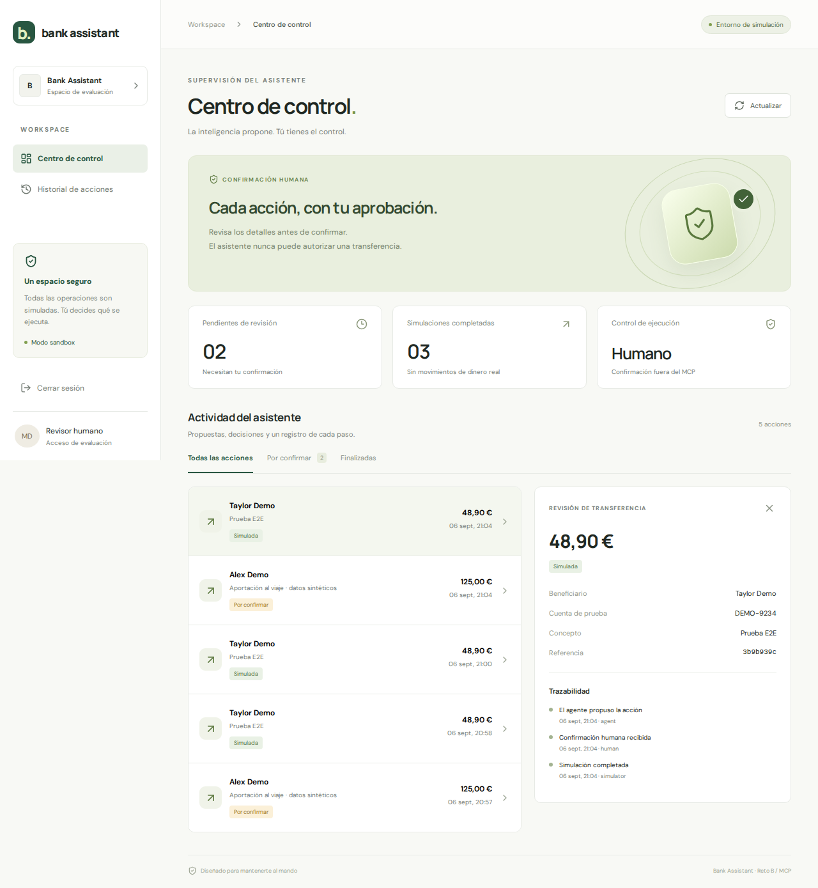
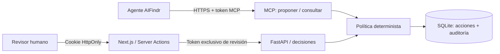
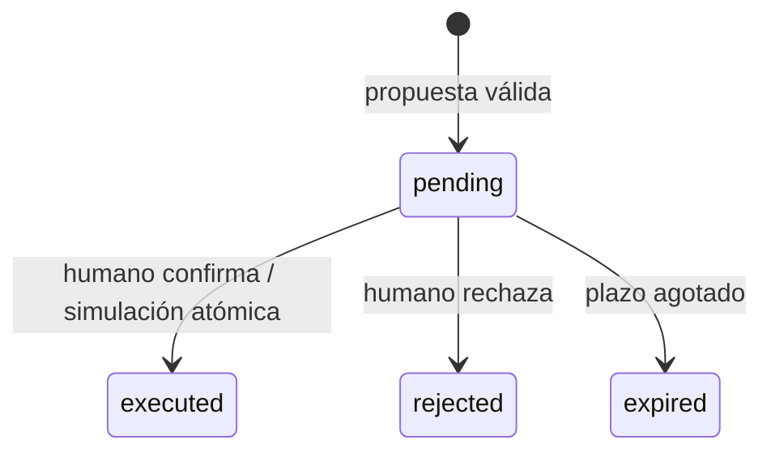

# Bank Assistant — Safe Actions

Centro de control para revisar transferencias **simuladas** propuestas por un agente mediante MCP. Next.js 16.3.4 + React 19 + TypeScript estricto; FastAPI + MCP SDK 2 + SQLite. Un monorepo, dos procesos y ninguna conexión bancaria.

> Estado de entrega: flujo local MCP → revisión web → simulación verificado; transporte HTTPS público autenticado probado con túnel temporal. La conexión a AIFindr DEV y la evaluación antes/después están pendientes del contrato de la Private API y de configurar el MCP en el proyecto. No se presentan resultados locales como evidencia del agente real.



## Arranque local

Requisitos: Node.js 22.22+ (LTS), Python 3.12+, [uv](https://docs.astral.sh/uv/getting-started/installation/). Desde la raíz:

```bash
python3 scripts/setup_local.py
cd backend
uv sync --locked
uv run uvicorn app.main:create_app --factory --host 127.0.0.1 --port 8000
```

En otra terminal:

```bash
cd frontend
npm ci
npm run dev
```

Abre http://127.0.0.1:3000 e introduce `REVIEW_PASSWORD` de `frontend/.env.local`. El generador no sobrescribe configuración previa. No uses la API key de AIFindr como contraseña. `backend/.env` y `frontend/.env.local` contienen tokens diferentes para MCP, revisión y sesión; todos están ignorados por Git.

Para crear una propuesta con datos ficticios por el **transporte MCP real**:

```bash
cd backend
uv run python ../scripts/demo_mcp.py
```

En la web: Actualizar → seleccionar propuesta → comprobar importe/destinatario → marcar confirmación → Confirmar simulación. Consulta la trazabilidad. El script no tiene capacidad de confirmar. Reiniciar el backend conserva las acciones en SQLite.

## Verificación

```bash
cd backend
uv run pytest -q
uv run ruff check .
uv run python ../scripts/benchmark.py
```

```bash
cd frontend
npm run lint
npm run typecheck
npm run build
npx playwright install chromium
npm test
```

El E2E requiere ambos servidores arrancados y la configuración local. Crea una propuesta vía MCP, inicia sesión, comprueba que el botón está bloqueado sin confirmación, ejecuta la simulación y revisa trazabilidad y layout móvil. Genera capturas con datos sintéticos en `docs/`. CI reproduce estas comprobaciones.

## Arquitectura



- El modelo decide cuándo **proponer**; el código valida importe, cuenta ficticia y estados. No se confía la autorización al prompt.
- MCP expone únicamente `propose_transfer` y `get_transfer_status` en `/mcp`, usando Streamable HTTP stateless. Las herramientas no aceptan `owner`, `confirmed` ni campos extra.
- Identidad fijada por configuración del servidor, nunca por el modelo. Alcance de esta prueba: un proyecto / un revisor. La capa de datos está aislada por propietario, pero no hay un sistema multiusuario público.
- Dinero en céntimos enteros, EUR, rango 1–100000. Solo destinos `DEMO-*`; imposible enviar a un banco real.
- Idempotencia por `(owner, key)` y hash de datos inmutables. Reutilizar clave con otros datos devuelve conflicto.
- `BEGIN IMMEDIATE`, restricción UNIQUE y simulación dentro de la misma transacción evitan dobles ejecuciones ante concurrencia. Esto no es una garantía de exactly-once para proveedores externos.
- SHA-256 identifica los datos que revisó el humano; no es firma digital ni sustituto de autenticación.
- Cookies firmadas con HMAC, HttpOnly y SameSite Strict, vencimiento de 8 horas. `Secure` obligatorio fuera del HTTP local. Las Server Actions verifican sesión en cada acceso. Next comprueba el origen de las mutaciones.
- TTL de propuesta de 10 minutos; la UI informa, pero el servidor determina la caducidad. Se materializa al leer/decidir, sin worker periódico.



`confirmed` es un evento de auditoría dentro de la transacción de ejecución, no un estado persistente intermedio: no existe trabajo asíncrono que justifique ese estado en este simulador.

## AIFindr y entrega

- [Conexión HTTPS y configuración de AIFindr](docs/integration.md).
- [Matriz de requisitos y estado real](docs/requirements.md).
- [Defensa de decisiones, riesgos y límites](docs/decisions.md).
- [Presentación asíncrona escrita](docs/presentation.md).
- [20 casos de evaluación](evaluations/cases.json), [hipótesis y cambio propuesto](evaluations/prompt-improvement.md).
- [Medición reproducible local](docs/benchmark.json).

No se incluyen documentos de la prueba, prompts originales, conocimiento del banco, credenciales o transcripts privados. Guarda ese material en `private/` (ignorado), incluso siendo un repositorio privado.
