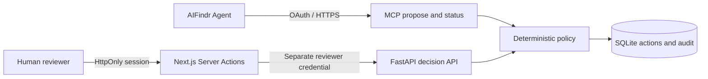

# Bank Assistant

AIFindr technical assessment, **Challenge B**: an authenticated MCP gateway proposes simulated EUR transfers; a separate human review UI confirms or rejects them. No bank or payment provider is connected.

**Evidence:** the AIFindr DEV agent created a proposal through OAuth MCP; a browser test signed into the review UI, explicitly confirmed it, and the agent subsequently reported `executed` with `simulated: true`. The first grounding comparison scored Control 19/20 and Variant B 17/20; the corrected B v2 scored 18/20 against a fresh Control run of 17/20, without establishing a reliable improvement over the original baseline. See [results](evaluations/results/2026-09-08-grounding.md) and the single [presentation](docs/presentation.md).

## Run locally

Requires Python 3.12+, [uv](https://docs.astral.sh/uv/), and Node.js 22.22+.

```bash
python3 scripts/setup_local.py
uv sync --locked --project backend
cd backend
uv run uvicorn app.main:create_app --factory --host 127.0.0.1 --port 8000 --no-access-log
```

In another terminal:

```bash
cd frontend
npm ci
npm run dev
```

Open <http://127.0.0.1:3000>. Use `REVIEW_PASSWORD` from `frontend/.env.local`.
The setup script creates separate MCP/reviewer/session credentials and preserves existing configuration. Never use the AIFindr API key as the review password. All `.env` files and SQLite databases are ignored by Git.

Create a synthetic proposal without AIFindr:

```bash
cd backend
uv run python ../scripts/demo_mcp.py
```

Open the proposal's `review_url`, sign in, inspect recipient/amount/destination/concept, check the explicit confirmation box, and confirm or reject. `/?action=<id>` selects the exact proposal after login. Opening a link or submitting an AIFindr lead form does not authorize execution.

## Connect AIFindr DEV

1. Expose port 8000 through a public HTTPS tunnel, for example `cloudflared tunnel --url http://127.0.0.1:8000`.
2. Set `OAUTH_ISSUER_URL` to its HTTPS origin and add the hostname to `MCP_ALLOWED_HOSTS` in `backend/.env`; restart the backend. Keep access logging disabled to avoid recording OAuth query strings.
3. In AIFindr Settings → Project → MCP Servers, register `<origin>/mcp`, request `transfers:propose-read`, and allow only `propose_transfer` and `get_transfer_status`.
4. Connect OAuth. Run the local approval command displayed by the gateway's consent page. This grants proposal/status access only. List the tools and enable the MCP.
5. Keep workflow **Agent**. Ask for a simulated transfer using a `DEMO-*` destination, then review it in the independent UI and ask the agent to refresh its status.

The native UI Component **Review a simulated MCP transfer** records a review request. Its form has no authenticated decision callback. Actual acceptance uses the reusable `TransferReview` component in Next.js, the authoritative `review_url`, and the human session. Use synthetic identity values when testing the native lead form.

`REVIEW_BASE_URL` defaults to local HTTP; set an HTTPS origin when hosting the frontend elsewhere. Enable secure cookies outside loopback HTTP. A temporary tunnel works only while its process is running; a changed hostname requires updated settings and OAuth reconnection.

OAuth uses the official MCP SDK with S256 PKCE, single-use 60-second codes, access tokens valid for up to one hour, rotating refresh tokens with a fixed one-day family lifetime, replay-triggered family revocation and a private SQLite token store. Grants are bound to the configured resource and owner. Client registration permits only AIFindr DEV callback origins. A compatibility adapter handles HTTP Basic client IDs omitted from the form while retaining SDK secret validation. The stateless gateway returns 405 for standalone GET SSE; normal MCP requests use POST JSON. Host/Origin checks remain enabled.

References: [AIFindr API](https://docs.aifindr.ai/docs/api/ai-findr-api/), [MCP authorization](https://modelcontextprotocol.io/specification/2025-11-25/basic/authorization), [MCP transport](https://modelcontextprotocol.io/specification/2025-11-25/basic/transports), [OAuth Basic authentication](https://datatracker.ietf.org/doc/html/rfc6749#section-2.3.1).

**Upgrade note:** after deploying the security audit changes, reconnect AIFindr OAuth. Older refresh records lack the required resource binding and are deliberately rejected. Changing the issuer or owner also requires reconnection; do not reuse an old grant for a new identity.

## Verify

```bash
uv run --project backend pytest backend/tests -q
uv run --project backend ruff check --config backend/pyproject.toml backend evaluations scripts
uv run --project backend python scripts/benchmark.py
```

With both local servers running:

```bash
cd frontend
npm run lint
npm run build
npm run typecheck
npx playwright install chromium
npm test
```

Browser tests cover MCP proposal, exact-action selection, login, explicit confirmation, rejection, authoritative audit events, idempotent retries, terminal-state conflicts and mobile overflow. Separate session tests cover malformed cookies and runtime identifier validation. Screenshots are test artifacts, not source files. Backend tests cover concurrent retries, altered fingerprints, conflicting idempotency keys, expiry/audit atomicity, owner isolation, credential separation, malformed or duplicated authorization, configuration file permissions and OAuth replay/resource binding. A dataset consistency test checks the delivered CSV/JSON and recorded score totals; it does not rerun or validate the original platform judge. GitHub Actions runs the same checks.

The [100-action benchmark](evaluations/results/gateway-benchmark.json) measures local SQLite proposal/confirmation/execution, excluding HTTP and LLM time. It also verifies that 32 confirmation retries leave exactly one execution event.

## Part 1: reproducible evaluation

Import [grounding-cases.csv](evaluations/grounding-cases.csv) into AIFindr Datasets; [grounding-cases.json](evaluations/grounding-cases.json) contains the same 20 English questions and criteria. Run Control before the candidate, keeping Agent, model/reasoning, knowledge version, tool configuration and judge unchanged. Preserve each execution, including regressions. The [report](evaluations/results/2026-09-08-grounding.md) contains three concrete before/after examples and explains the measurement limitations; its JSON companion records all cases.

The separate `evaluations/cases.json` covers action-safety scenarios. Optional capture/review utilities can be explored with:

```bash
backend/.venv/bin/python -m evaluations.run --help
backend/.venv/bin/python -m evaluations.compare --help
backend/.venv/bin/python -m scripts.check_aifindr
backend/.venv/bin/python -m scripts.check_integration --url https://YOUR-HOST/mcp
```

These readers use documented **Private API** conversation list/detail endpoints on DEV, with Bearer and `X-Organization-Id`. Configure `AIFINDR_API_KEY`, `AIFINDR_PROJECT_ID` and `AIFINDR_ORGANIZATION_ID` through `.env` (the existing `frontend/.env` key is also supported by CLI code). There is no invented private chat/write endpoint or Widget API substitute. Raw prompts, transcripts and capture manifests must stay under ignored `private/`, with mode-0600 output.

## Architecture and trade-offs



- The model can propose, not authorize. MCP exposes no confirmation tool; the reviewer credential is never shared with the agent or browser. Protected read/decision Server Actions check the signed session; Next.js also checks mutation origins.
- Amounts are integer EUR cents, 1–100000. Destinations must be synthetic. Owner identity comes from server configuration, never model input.
- A proposal fingerprint binds confirmation to immutable data. It is not a signature or a replacement for authentication. Reusing an idempotency key with changed data conflicts.
- SQLite uniqueness plus `BEGIN IMMEDIATE` serializes the synchronous simulation. `pending` becomes `executed`, `rejected` or `expired`; `confirmed` is an audit event inside the execution transaction. This does not promise exactly-once delivery to an external payment provider.
- Proposals expire after ten minutes by default. Server time is authoritative. State persists across restarts; the UI refreshes explicitly.

Scope: one project and one shared reviewer, one SQLite instance, simulated operations only. No OIDC/MFA, distributed rate limiting, external tamper-resistant audit, background payments or multi-instance storage. Sessions last eight hours; logout removes the browser cookie, while a copied cookie remains valid until expiry or secret rotation. The action list shows the latest 100 records. Persistent deployment needs stable HTTPS, proxy limits and durable storage; real financial execution would require a different identity, approval and reconciliation design.

## Submission boundary

The repository provides executable code, locked dependencies, automated checks, the assessment dataset, recorded results and one presentation. `frontend/AGENTS.md` was generated coding-agent scaffolding, not an assessment deliverable; it is excluded. Private prompts, transcripts, credentials, databases and browser artifacts must remain untracked. Negative evaluation results and known limitations are intentionally preserved.

The acceptance mapping here is based on this repository's declared scope, not a separately supplied original assessment brief. A green code/test run does **not** certify all external assessment requirements. Before delivery, verify the original brief, the live AIFindr connection and permissions, and the native Playground component. The recorded prompt experiments do not establish a reliable improvement over the original Control run. A lead-form submission remains distinct from authenticated transfer confirmation.
